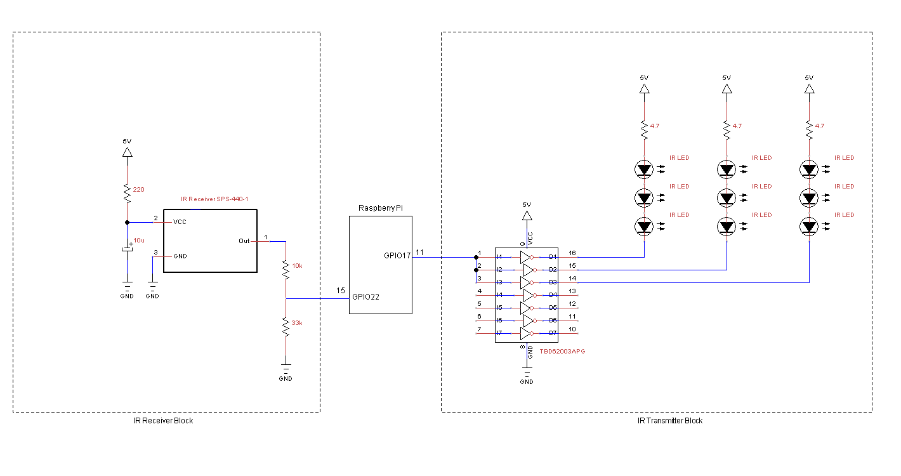

# LIRC Configuration for DAIKIN Air Conditioner


## Abstract

This repository provides LIRC configuration file for DAIKIN air conditioner.

This repository contents are a part of my Raspberry-Pi's IR remote commander project.


- - -

## Contents of This Repository

    * README.md                     This file.
    * daikin-aircon.conf            LIRC remote configuration file for DAIKIN air conditioner.
    * scripts/                      
        format-alt-data.pl          PERL script to format the capture data file.
        create-conf.sh              Shell script to create LIRC remote configuration file.
        capture-ir.sh               Reference shell script to capture DAIKIN IR signals.
<br/>

- - -

## Prerequisites

### Hardware
Assume your Raspberry-PI has already set up the IR transmitter circuit.

Following schematic is an example. Note that take care of the total current consumption, because LED's current consumption is much higher than you think.
<br/>



## Software - config.txt
To enable IR modules, edit 'GPIO LIRC' section in file '/boot/config.txt'.

Find the IR configuration section (if any) and insert the following lines.

```
        dtoverlay=gpio-ir,gpio_pin=22
        dtoverlay=gpio-ir-tx,gpio_pin=17
```

Here, GPIO #17 (pin#11) is assigned as output pin (IR Transmitter), and GPIO #22 (pin#15) is assigned as output pin (IR Receiver).

RPi must be rebooted to activate these configurations.

<br/>

- - -

# How to Use

1. Download 'daikin-aircon.conf' and put it in /etc/lirc/lircd.conf.d (or /etc/lirc/remotes, depending on your LIRC version).

2. Edit '/etc/lirc/lircd.conf' to include DAIKIN LIRC configuration file, if necessary.
   (If your lircd.conf includes line 'include "lircd.conf.d/*.conf"', you don't have to do anything on lircd.conf.)
   Add 'include' statements to include your command definition files as follows.
   
```
        include "/etc/lirc/remotes/daikin-aircon.conf"
```

3. Restart LIRC service.

```
        # systemctl restart lircd
         (or, 'service lirc restart', depending on your Linux version.)
```

4. Try it.
* To list IR modules:

```
        # irsend LIST '' ''
            :
            :
        aircon
            :
            :
```

* To list commands for DAIKIN air conditioner:

```
        # irsend LIST aircon ''
            :
            :
        00000000000001ea heater-wind5-29.5
        00000000000001eb heater-wind5-30.0
        00000000000001ec off
```

* To power on DAIKIN air conditioner with 'AUTO' mode:

```
        # irsend aircon auto
```

* To power on DAIKIN air conditioner on cooler mode with 26.5 degrees centigrade and with auto wind mode:

```
        # irsend aircon cooler-auto-26.5
```

* To power off DAIKIN air conditioner:

```
        # irsend aircon off
```

- - -

# [Appendix] How to Capture IR Signals

First of all, IR interface daemon 'lirc' must be stopped manually to capture the IR signals by hand, otherwise 'resource busy' error may occur.

```
        # systemctl stop lircd
        (or 'service lirc stop')
```

To examine whether the IR signal of remote commanders is captured, use command 'mode2'. Device name may vary, but usually it's lirc0 or
lirc1.

```
        # mode2 -d /dev/lirc0
```

Press any button on your arbitrary remote commander toward the IR receiver module. If IR signal is correctly captured, signal is shown as follows, for example.

```
      space 1514
      pulse 655
      space 1504
      pulse 678
      space 1487
      pulse 684
      space 401
      pulse 642
```

Usually, command 'irrecoed' is used to capture IR commands issued by IR commander.
But we cannot use it to capture the air conditioner's IR commands,
because the length of IR commands used by air conditioners is too long (about over 600ms!) to capture by 'irrecord'.
To capture air conditioners' IR commands, command 'mode2' must be used instead of 'irrecord'.
Note that option '-m' must be given to 'mode2'.

```
        # mode2 -d /dev/lirc0 -m | tee aircon-off.txt
        # mode2 -d /dev/lirc0 -m | tee aircon-cooler-29.0.txt
        # mode2 -d /dev/lirc0 -m | tee aircon-cooler-28.5.txt
        # mode2 -d /dev/lirc0 -m | tee aircon-cooler-28.0.txt
           :
           :
           :
```

Next, reformat these files in accordance with LIRC formats.  You can use script ['scripts/format-alt-data.pl'](scripts/format-alt-data.pl) for this task.

Finally, create the configuration file for LIRC. To unite above IR signal files, you can use script ['scripts/create-conf.sh'](scripts/create-conf.sh).

```
        # create-conf.sh > daikin-aircon.conf
```

